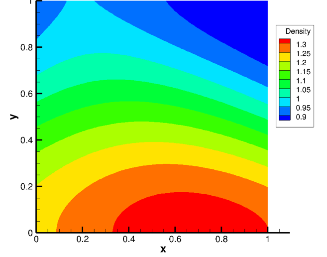
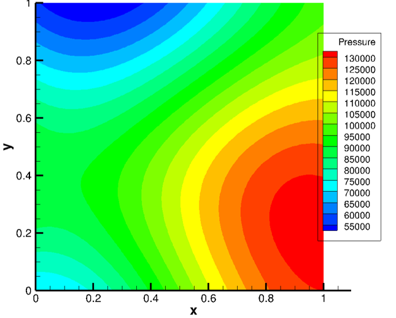
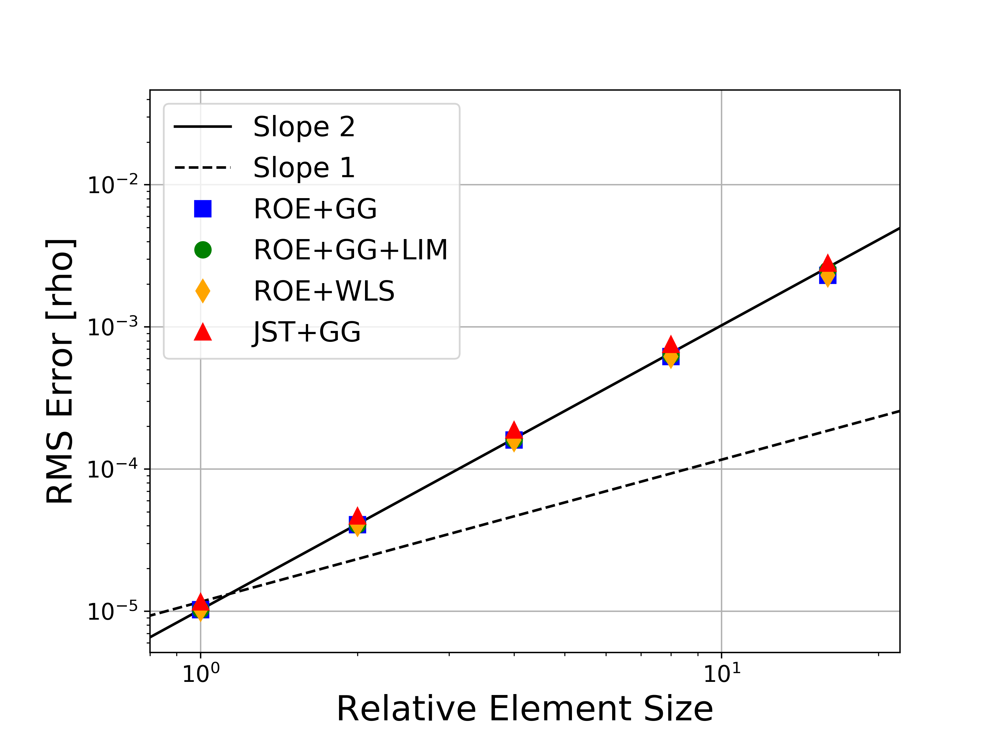
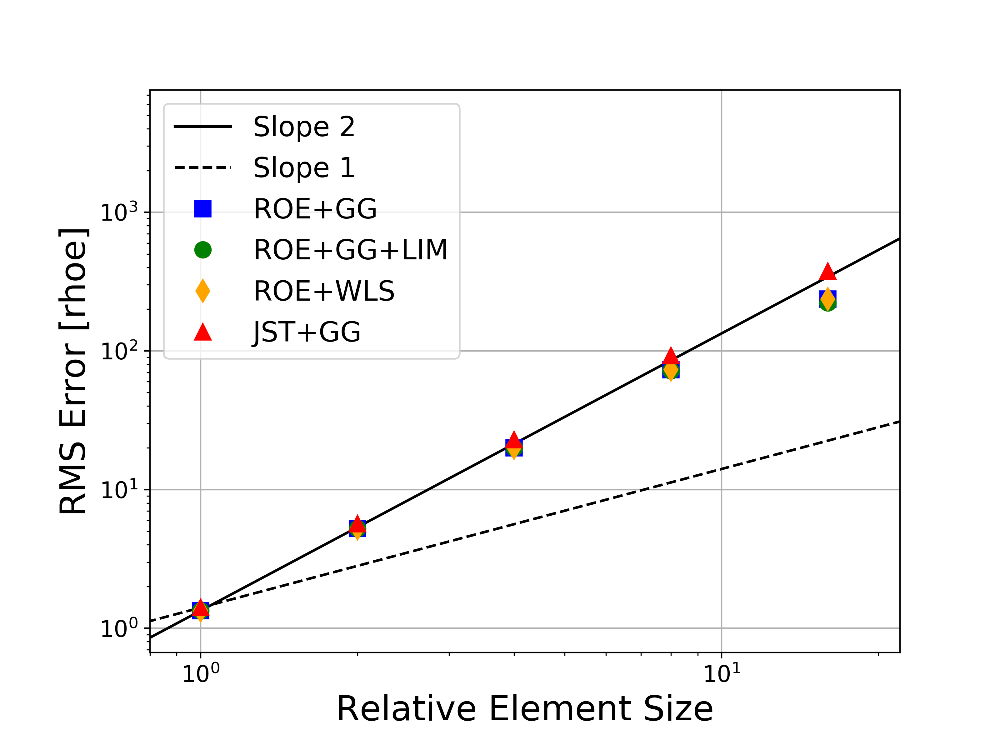
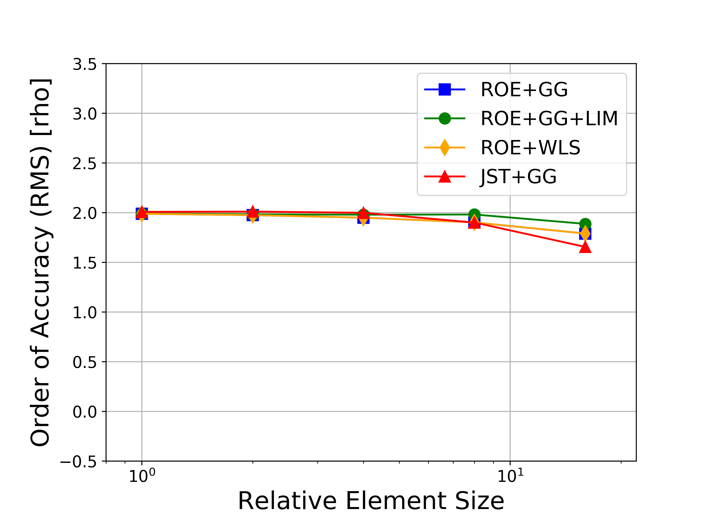
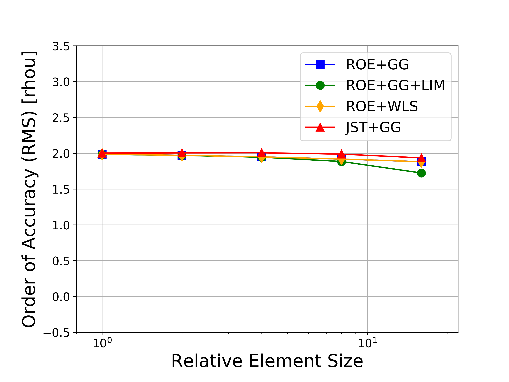
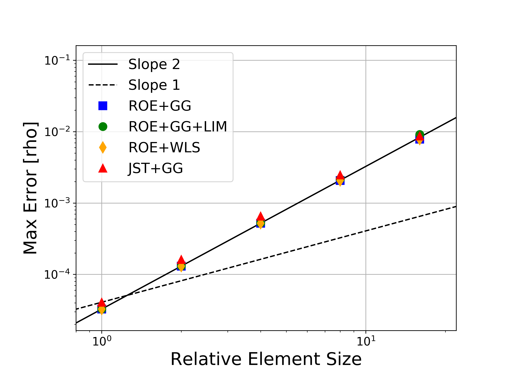
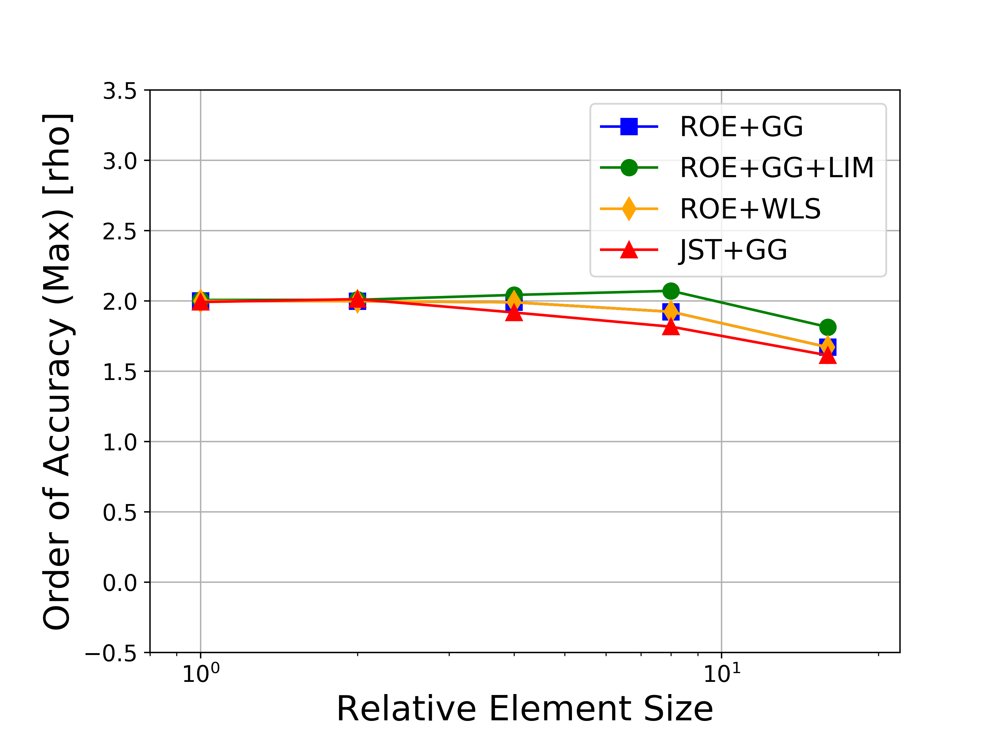
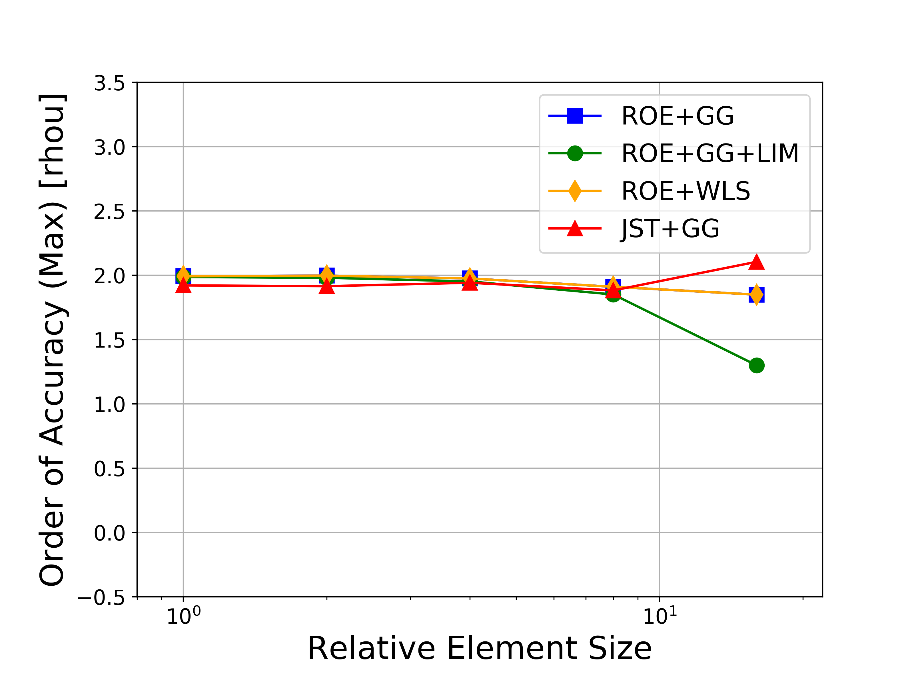
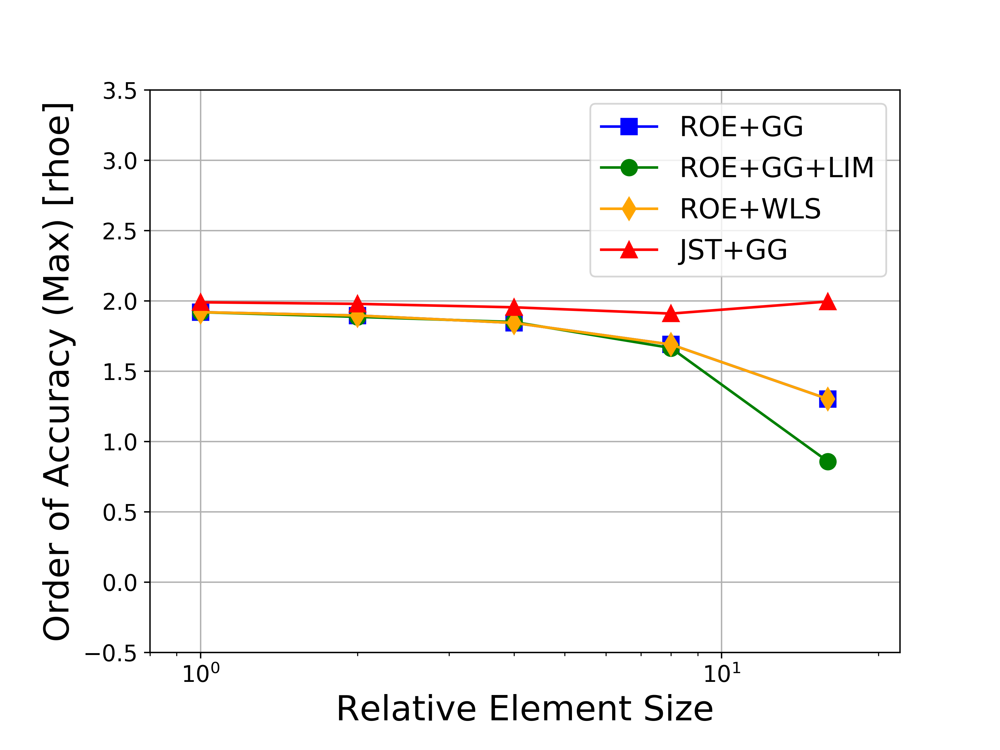

# Method of Manufactured Solutions (MMS) for Compressible Navier-Stokes

This page contains the results of running MMS for the compressible Navier-Stokes system in order to formally verify the order-of-accuracy for the 2nd-order finite volume solver in SU2. These cases were completed with SU2 v7.0.0.

For more details, please see the presentation on the subject from the [4th Annual SU2 Developers Meeting](https://su2foundation.org/wp-content/uploads/2019/05/SU2_Verification_EdwinTom.pdf). 

## Problem Setup

The basic concept behind the Method of Manufactured Solutions (MMS) is to verify a code by ensuring that it reproduces a predefined solution (the "manufactured solution") when the governing equations are forced with the source term that corresponds to the manufactured solution. Verification is then possible by computing formal order of accuracy using the global error on a sequence of refined grids.

The 2D manufactured solution used in this case for the compressible Navier-Stokes equations is given by:

which will be solved on a unit quad domain. Contours of the solution are shown below.

A symbolic manipulation package such as Maple or SymPy is used to generate the required source terms automatically by evaluating the governing equations at the manufactured solution.

## Results

The results for solving the 2D MMS problem on a sequence of 5 grids are given below. The unit domain meshes are composed of quadrilaterals (triangles are also possible), and the mesh sizes are 9x9, 17x17, 33x33, 65x65, 129x129, and 257x257. 

Several variations of the numerical methods are tested, namely the Roe upwind scheme with and without limiters, the JST scheme, and both the Green-Gauss and weighted least-squares approaches for computing flow variable gradients. In the figures, the abbreviations represent the following: Roe = Roe uwpind scheme with 2nd-order MUSCL reconstruction, JST = Jameson-Schmidt-Turkel centered scheme, GG = Green-Gauss gradient method, LIM = Venkatakrishnan-Wang limiter, WLS = Weighted Least-Squares gradient method.

Figures containing the formal order of accuracy and the global error for both L-infinity and L2 norms are shown below. The figures with the global error also present the ideal slopes for first- and second-order accuracy. As expected for the finite volume solver in SU2, all results correctly asymptote to second-order accuracy as the mesh is refined, which verifies the accuracy of the solver for the methods investigated.

If you would like to run the MMS problems for yourself, you can use the files available in the [SU2 V&V repository](https://github.com/su2code/VandV/tree/master/mms/fvm_navierstokes). The compute_order_of_accuracy.py script drives the other files in this folder. Simply set the number of ranks on which to run the cases by modifying the 'nRank' variable at the top of the script and then execute with:

$ compute_order_of_accuracy.py

The script will automatically generate the required meshes and execute SU2 solutions for the four different cases on those meshes for comparison. Four config files are provided, but you can modify them or add new ones. Simply change the config files listed at the top of the compute_order_of_accuracy.py script. Postprocessing is also automatically performed by the script, including the creation of figures for global error vs relative grid size and observed order of accuracy vs relative grid size.

